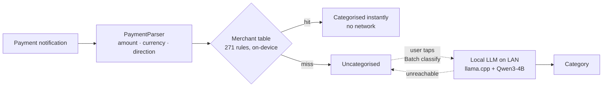

# Expense Tracker

A personal expense tracker for Android. Native Java, no backend, no analytics, no
third-party SDKs beyond AndroidX and Material Components.

Built for my own use in Australia, so it handles **CNY and AUD side by side** and
reads payment notifications from the apps I actually pay with. The UI is in Chinese.

---

## Why this one is interesting

Most expense trackers make you type everything in. This one tries to remove that
friction in two places, and the second one is the part worth reading:

**1. It reads payment notifications.** A `NotificationListenerService` watches
Alipay / WeChat Pay / UnionPay notifications and turns them into draft records.
`PaymentParser` pulls out the amount and currency with a regex that deliberately
*rejects* numbers preceded by words like 余额 (balance) or 积分 (points) — the
common way naive parsers record your account balance as a purchase.

**2. Categorisation is two-tier, and the model is the fallback, not the default.**



The merchant table runs **in the notification callback**: pure string matching,
microseconds, no network. Only records it misses get offered to a language model,
and only when the user explicitly asks — so the common path never touches the
network at all, and a dead server degrades to "uncategorised" rather than to
wrong data.

The model runs on a **spare Android phone on the same LAN** (llama.cpp serving
Qwen3-4B-Instruct, Q4). Financial data never leaves the house and there is no
third-party API in the loop.

---

## Matching rules that survive real bank descriptions

The merchant table looked trivial until it met an actual CommBank statement.
Two defects it forced out, both of which had been silently writing wrong data:

**Latin keywords need word boundaries; CJK keywords must not have them.**
Plain substring matching made `UTS` fire on `KRISPY KREME DONUTS` (filing donuts
under Education) and `RENT` fire on `CURRENT ACCOUNT FEE`. Chinese has no word
boundaries, so the same rule cannot apply to both — the matcher branches on
whether the keyword is ASCII.

**Boundaries then have to bend in two specific ways**, or real merchants stop
matching:

| Case | Example | Handling |
|---|---|---|
| Possessive / plural | `MCDONALD` must hit `MCDONALDS` | accept a single trailing `s` |
| Run-together names | `GUSMAN` must hit `GusmanYGomezWestfiel` | relax the right boundary for keywords ≥ 6 chars |
| Asterisk separators | `UBER EATS` must hit `UBER *EATS` | normalise `*` to a space before matching |

That last one mattered: without it `UBER *EATS` fell through to the shorter
`UBER` rule and every food delivery got filed as **transport**.

Short keywords stay strict — `SHELL` must not match `SHELLEY`, `GYM` must not
match `GYMEA`. Reviewing the false positives showed almost all of them were
caught by the *left* boundary, which is why relaxing only the right one by
length is safe.

---

## What the numbers actually are

Measured against a real bank statement (72 expense rows), not a hand-made
fixture:

| | |
|---|---|
| Merchant table coverage, generic rules only | **27.8 %** |
| Model-only accuracy (30 labelled samples) | **83.3 %** |
| Decode speed, Qwen3-4B Q4 on Snapdragon 8 Elite | **~38 tok/s** (~2 s per record) |

The model's errors were not reasoning failures — they were knowledge gaps. Every
miss was a utility or a local chain (`SYDNEY WATER`, `TELSTRA`, `AGL`,
`OFFICEWORKS`), and it defaulted unknown local businesses to "transport". That is
the argument for a lookup table in front of the model rather than a bigger model
behind it.

Adding one's own frequent merchants pushes coverage well past 80 %, but that
number is fitted to the same statement it was measured on, so it is not quoted
here as a result.

---

## Privacy design

- Reading notifications, parsing amounts, and merchant lookup are **entirely
  on-device and offline**.
- The only network call is the optional LLM fallback, which goes to a host the
  user types in — nothing else, no telemetry.
- The built-in merchant table ships only **national chains and generic terms**.
  Your own corner shops go in a **personal merchant table** stored in the app's
  private directory, never committed and never shipped: a list of specific small
  businesses is enough to infer where somebody lives and studies.
- Records stay in local SQLite. Backup is CSV export to a folder you choose (SAF).

---

## Features

- Manual income/expense entry, editing, recurring transactions
- Dual currency (CNY / AUD) with per-currency and combined overview
- Category pie chart, six-month trend, drill-down by category; month and year views
- Custom categories (icon + colour), on top of seven presets
- CSV import/export with de-duplication; optional daily auto-backup
- 2×2 home screen widget
- Light/dark theme following the system

## Tech

Java · minSdk 26 / target 34 · SQLite (schema v4, migrating) · `NotificationListenerService` ·
Storage Access Framework · AppWidgetProvider · custom `View` for the pie chart ·
`HttpURLConnection` for the LLM call (no HTTP library)

## Build

```bash
./gradlew assembleDebug
```

`local.properties` (your Android SDK path) is intentionally not committed; Android
Studio will create it on first open.

## Limitations

- Notification parsing only works for apps that post a notification containing an
  amount — cash and silent transactions are invisible to it.
- The LLM fallback needs a server you run yourself; without one the app simply
  leaves records uncategorised.
- Exchange rates are fetched from a public API for display only and are not
  applied to stored amounts.
